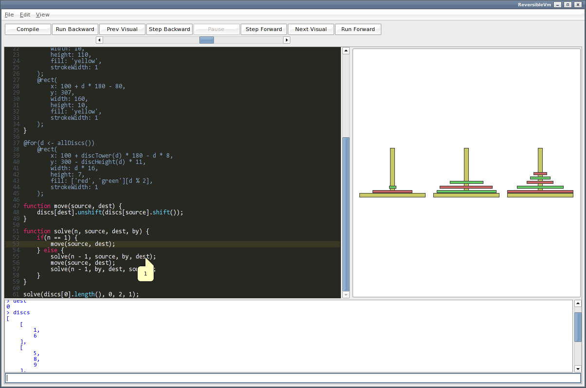

ReversibleVM
============

An editor and virtual machine for a JavaScript like language that allows running a program backwards and forwards, with
an animated graphical visualisation.

For example, a sorting algorithm can be displayed using:

	@delay(transition: 50, instruction: 2);

	a = [7, 3, 1, 8, 4, 6, 2, 6, 2, 3, 8, 1, 10, 7, 3, 6, 2, 3, 8, 1];
	a = a.map(x => { value: x });

	@for(item <- a)
		@rect(
			x: 40,
			y: 15 * a.indexOf(item) + 20,
			width: 20 * item.value,
			height: 8,
			fill: a.indexOf(item) < x ? 'green' : 'red',
			strokeWidth: 1,
			stroke: '#333'
		);

	@rect(
		x: 10,
		y: 15 * x + 20,
		width: 20,
		height: 8,
		fill: 'cyan',
		strokeWidth: 1,
		stroke: '#000'
	);

	@rect(
		x: 10,
		y: 15 * y + 20,
		width: 20,
		height: 8,
		fill: 'yellow',
		strokeWidth: 1,
		stroke: '#000'
	);

	for(var x = 0; x < a.length(); x++) {
		for(var y = x; y < a.length(); y++) {
			if(a[x].value > a[y].value) {
				@vizUpdatesOff;
				var t = a[x];
				a[x] = a[y];
				a[y] = t;
				@vizUpdatesOn;
			}
		}
	}

Features
--------

* Run program backwards and forwards one line or visual change at a time.
* Visualize state of program with declarative language.
* Animation of transitions between states, and automatic update when values change.
* Interactive console to evaluate expressions.
* Tooltips to see value of variables within the execution of a program.
* Slider to move program state forwards and backwards.

Installation
------------

* Replace lib/swt.jar with your platform specific library from: from http://www.eclipse.org/swt/.

* Build with ant:

        ant jar
    
Usage
-----

    java -jar reversiblevm.jar [-f filename] [-g] [-h] [filename]
